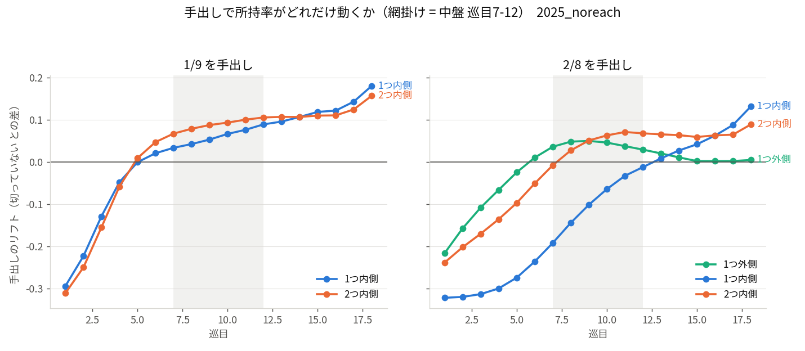
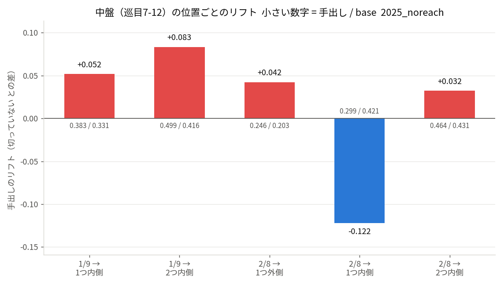
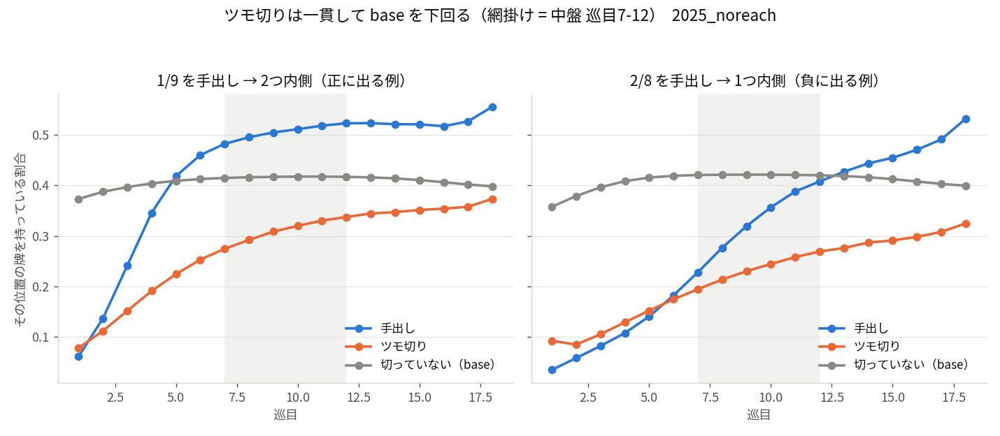

# 中盤の 1/9・2/8 手出しと、その周りの牌

## 分析の意図

麻雀では不要な牌を**外側から順に処理する**のが普通なので、端に寄った牌は序盤のうちに捨て牌に並ぶ。
だから中盤以降になって 1/9 や 2/8 が手出しされたとき、その牌は単なる浮き牌ではなく、
**周りの牌と絡んでいたものが崩れて出てきた**と読める。この読みを牌譜で定量化する。

もともとは「逆切り」（内側の牌を切った後に外側の牌を手出しする）を条件にして測ろうとしたが、
その条件が中盤以降ほぼ全員に当てはまってしまい、比較が成立しなかった（[別項](#逆切りという条件では測れなかった)）。
そこで先行条件を外し、「**その巡目にその牌を手出しした**」ことだけを条件にしている。

## 分析方法

- **データ**: 天鳳・鳳凰卓（4 人半荘）MJAI、2025 年 全対局 178,888 半荘。リーチ除外、門前のみ。
  対象打牌は 1/9 が 10,325,100、2/8 が 6,134,027（いずれも手出し）。
- **3 状態**（同じ打牌時点の同じ位置を、そこで起きたことで分ける）
  - **手出し** … その打牌でその位置が手出しされた。
  - **ツモ切り** … その打牌でその位置がツモ切りされた。
  - **切っていない（base）** … その打牌でその位置には何も起きていない。
    各打牌時点の 3 色 × 位置 1..9 のうち、実際に切られた位置を除いたすべて。
- **base をツモ切りに取らない理由**: ツモ切りは「引いたが要らなかった」という選択で、
  それ自体が強い負の情報を持つ（後述のとおり全クラス・全巡目で base を下回る）。
  ツモ切りを基準にすると手出しの効果を過大に見積もる。
- **測定**: 切った牌から見て **1 つ外側 / 1 つ内側 / 2 つ内側** の位置の牌を、
  打牌直後の同色門前手牌に **1 枚以上**持っているか（0/1）。内側は中心（5）に向かう向き。
  窓としてまとめず**位置ごとに別々に測る**。1/9 は外側が盤外なので 2 位置、2/8 は 3 位置。
- **指標**: 成立率と、base との差（リフト）。差は base の水準で圧縮されるためオッズ比を併記する。
- 巡目 = そのプレイヤーの打牌回数、赤 5 は 5 に統合。鏡像（1 と 9、2 と 8）は折り畳む。
- 再現: プロジェクト直下で
  `python3 scripts/tedashi_window.py --data-dir ~/WorkSpace/blog/08.mahjong/data/2025 --no-reach --workers 16 --cache counters_window_2025_noreach.npz`
  （図は `cd scripts && python3 figs_window.py --cache ../counters_window_2025_noreach.npz --outdir ../figures`）

## 結果

### 中盤（巡目 7-12）

| 切った牌 | 見る位置 | 手出し | ツモ切り | base | リフト | オッズ比 |
|---|---|---|---|---|---|---|
| 1/9 | 1 つ内側 | 0.383 | 0.213 | 0.331 | **+0.052** | 1.25 |
| 1/9 | **2 つ内側** | 0.499 | 0.302 | 0.416 | **+0.083** | **1.40** |
| 2/8 | 1 つ外側 | 0.246 | 0.134 | 0.203 | **+0.043** | 1.28 |
| 2/8 | 1 つ内側 | 0.299 | 0.226 | 0.421 | **−0.122** | 0.59 |
| 2/8 | 2 つ内側 | 0.464 | 0.305 | 0.432 | +0.032 | 1.14 |

### 巡目ごとの推移

**1/9 を手出ししたとき**（手出し / ツモ切り / base）

| 巡目 | 1 つ内側 | 2 つ内側 |
|---|---|---|
| 1 | 0.072 / 0.091 / 0.367 | 0.062 / 0.079 / 0.373 |
| 4 | 0.310 / 0.170 / 0.358 | 0.346 / 0.191 / 0.404 |
| 6 | 0.365 / 0.196 / 0.344 | 0.460 / 0.253 / 0.413 |
| 9 | 0.383 / 0.215 / 0.330 | 0.505 / 0.309 / 0.417 |
| 12 | 0.408 / 0.227 / 0.319 | 0.523 / 0.337 / 0.417 |
| 15 | 0.425 / 0.232 / 0.306 | 0.521 / 0.351 / 0.411 |
| 18 | 0.474 / 0.248 / 0.293 | 0.556 / 0.373 / 0.398 |

**2/8 を手出ししたとき**

| 巡目 | 1 つ外側 | 1 つ内側 | 2 つ内側 |
|---|---|---|---|
| 1 | 0.083 / 0.129 / 0.300 | 0.035 / 0.093 / 0.358 | 0.118 / 0.145 / 0.357 |
| 4 | 0.176 / 0.105 / 0.242 | 0.108 / 0.129 / 0.408 | 0.271 / 0.207 / 0.407 |
| 8 | 0.255 / 0.134 / 0.207 | 0.277 / 0.214 / 0.421 | 0.457 / 0.294 / 0.430 |
| 12 | 0.214 / 0.134 / 0.185 | 0.408 / 0.269 / 0.420 | 0.507 / 0.344 / 0.439 |
| 15 | 0.171 / 0.121 / 0.168 | 0.455 / 0.291 / 0.412 | 0.499 / 0.371 / 0.440 |
| 18 | 0.158 / 0.099 / 0.153 | 0.532 / 0.325 / 0.399 | 0.525 / 0.390 / 0.436 |

### ツモ切りとの対比

**平均リフト**（そのクラスで盤内にある位置の単純平均）

| 巡目 | 1/9 手出し | 1/9 ツモ切り | 2/8 手出し | 2/8 ツモ切り |
|---|---|---|---|---|
| 4 | −0.053 | −0.200 | −0.167 | −0.205 |
| 8 | +0.061 | −0.124 | −0.023 | −0.139 |
| 12 | +0.098 | −0.086 | +0.028 | −0.099 |

## 考察

- **中盤以降の端牌手出しは、周りを持っている側に傾く**。1/9 は巡目 5 で base を超え、
  中盤には 2 つ内側で +0.083（オッズ比 1.40）。2/8 は立ち上がりが遅く、平均で base を超えるのは巡目 10 前後。
  セオリーの向きどおりだが、**効果量は大きくない**。間隔切りで得られた +0.23 とは桁が違う。
- **正の情報は端寄りの位置に出る**。1/9 では 1 つ内側（+0.052）より **2 つ内側（+0.083）** が強い。
  1 を切った人が持っているのは 2 より 3 で、13 や 133 のような形が残りやすいと読める。
  2/8 でも 1 つ外側（+0.043）が正で、8 を手出しして 9 を持っている（99, 89）形が残る。
- **1 つ内側は中盤では負**。2/8 の 1 つ内側は **−0.122**（オッズ比 0.59）で、今回いちばん大きい値。
  8 を手出しした人は 7 を持っていない。正のリフトより絶対値が大きく、
  **「持っている」より「持っていない」ほうが確度が高い**。
  この位置が正に転じるのは巡目 13 以降で、中盤の読みとしては使えない。
- **base の動き方が位置で違うことが形を決めている**。1 つ外側（端の側）の base は
  巡目とともに 0.300 → 0.153 と大きく下がるのに対し、1 つ内側・2 つ内側の base は 0.42 前後でほぼ一定。
  端牌は巡目とともに手牌から消えるが、中張は残り続ける。
  2/8 の 1 つ外側で成立率自体は巡目 8 の 0.255 をピークに下がるのに
  リフトが中盤で最大になるのは、base のほうがそれ以上に下がるため。
- **ツモ切りは全クラス・全巡目で base を下回る**（1/9 で −0.086〜−0.200、2/8 で −0.099〜−0.205）。
  引いた牌を残さなかった以上、その周りも持っていないという読みが、手出しの正の情報より一貫して強い。
  base をツモ切りに取ると手出しの効果が過大に出るので、ここは分けて扱う必要がある。
- **事象が緩いぶん差が圧縮されている**。base が 0.33〜0.44 と高いため、リフトは小さく見える。
  オッズ比で見ても 1.25〜1.40 なので、劇的な差ではない。ただし所持率が 0.416 から 0.499 に動くのは
  実戦の読みとしては小さくない幅で、単独で使うより他の条件と重ねる材料になる。

## 逆切りという条件では測れなかった

当初は「内側の牌を切った後に外側の牌を手出しする」（逆切り）を条件にして測ろうとしたが、
**条件が中盤以降に飽和して対照群が壊れる**ため、この形では測れなかった。記録として残す。

- 「それまでに自分より内側のクラスの数牌を切っている」を色不問で取ると、該当率は
  1/9 の手出しで巡目 2 の 3.0% から**巡目 10 で 96.3%、巡目 15 で 99.7%** まで上がる。
  中盤以降は条件がほぼ常に成立するので、条件そのものが情報を持たない。
- 残った対照（中盤に内側の数牌を 1 枚も切っていない人）は、字牌ばかり処理している特殊な層で、
  数牌を多く抱えている。そのため対照の成立率が 0.26 → 0.83 と上がり続け、
  中盤以降はリフトが負に転じる。これは逆切りの情報ではなく対照の異常さを測っている。
- 同色に限定すると今度は逆の問題が出る。同色で内側を切ること自体がその色の牌を減らすので、
  対照（その色をまだ触っていない人）の成立率が 0.89 まで上がり、やはり比較にならない。
- つまり交絡の本体は「**その色をどれだけ切ったか**」で、これが逆切り条件と窓内所持の両方に効いている。
  セオリーが誤っているのではなく、この定義では切り分けられない。

## 完成面子を除く集計も試した

「9 を切った人が持っている 7」が 567 のような完成面子の一部なら、未完成のブロックとは意味が違う。
そこで、**その牌を 1 枚抜いても最大面子数が変わらない**位置だけを数える集計も取った
（567 の 7 は抜くと面子が崩れるので落ち、77 や 79 は残る）。

- **base は狙いどおり下がる**（1/9 の 2 つ内側で 0.416 → 0.247、2/8 の 1 つ内側で 0.421 → 0.250）。
  事象が緩いという見立ては正しく、完成面子がかなり混ざっていた。
- ただし**手出しの正のリフトは縮む**（1/9 の 2 つ内側で +0.083 → +0.043、オッズ比 1.40 → 1.25）。
  中盤の端牌手出しで増えていた周辺の牌には、完成面子の一部が相当含まれていたことになる。
- **例外は 2/8 の 1 つ外側**で、ここだけリフトが +0.043 → +0.053、オッズ比が 1.28 → 1.47 と上がる。
  端の未完成ブロック（99, 89）として残っている形で、完成面子を除いたほうがはっきり出る唯一の位置。
- **負の側はほぼそのまま**（2/8 の 1 つ内側は −0.122 で不変、オッズ比は 0.59 → 0.44 とむしろ強まる）。
  「切った牌の 1 つ内側は持っていない」は完成面子と関係なく成立する。
- この判定では**スライド**（567 から 7 を動かして使う形）が拾えない。承知のうえでの集計。

## 留意点

- 対象は門前手牌のみ・リーチ前のみ。副露者は測っていない。
- 「切っていない」には、その打牌時点で手牌にその牌が無い場合も含む。位置に何も起きていない状態を指す。
- 終盤（巡目 13 以降）はリーチが無くても降りている打牌が混ざるため、検証には中盤が適している。
  表には終盤も載せてあるが、解釈には注意が要る。
- 所持は 1 枚以上（P >= 1）で、対子かどうかは区別していない。
- 位置ごとに測っているため、「窓内に合計何枚あるか」という指標は含まない。
- 巡目 19 以降は最終ビンにまとめている。
