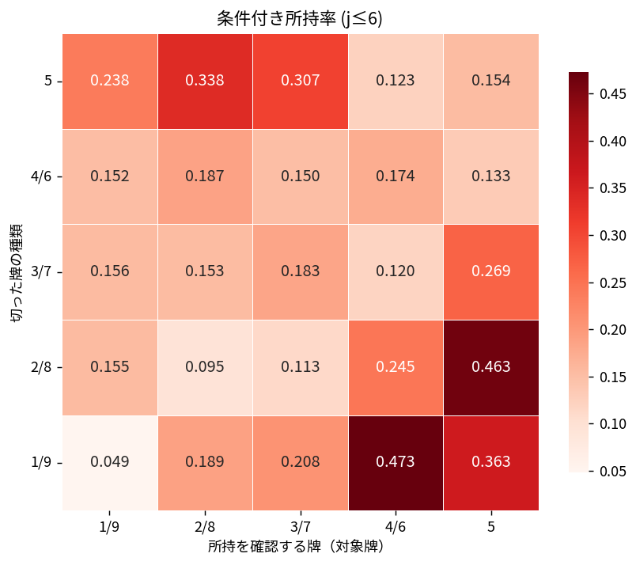
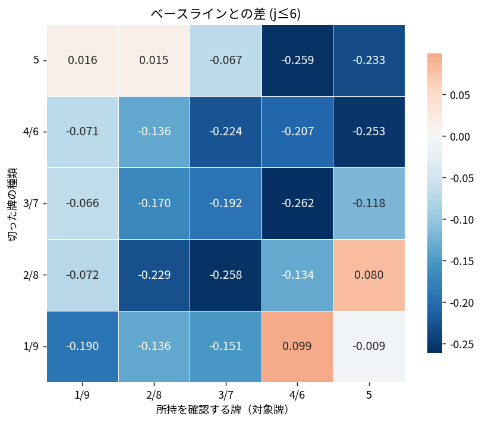
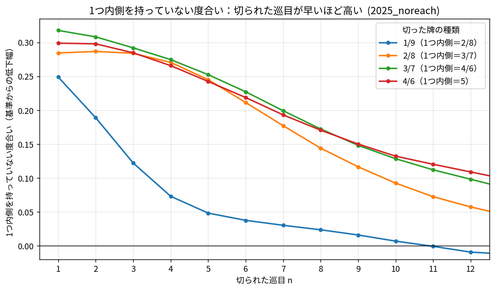

# 序盤の切りのそばは持たれていない — 数字別・内外別の非所持濃度

## 分析の意図

麻雀のセオリー「序盤に切った牌のそばには（自分の手に）その周りの牌が無い」を牌譜から定量化する。単に成否を見るだけでなく、**切った牌の数字（端距離クラス）ごと**に、そして**切った牌の内側（中心方向）と外側（端方向）**で、どの位置がどれだけ持たれていないかの濃度差を細かく見る。記事化に向けて、序盤の切りから読める情報を1枚の図に集約するのが狙い。

## 分析方法

- **データ**: 天鳳・鳳凰卓（4人半荘）MJAI、2025年 全対局 178,888半荘。リーチ除外。序盤の対象切りは 2,500万件超（j≤6、クラス別 n: 1/9=1166万, 2/8=619万, 3/7=322万, 4/6=274万, 5=119万）。
- **対象（トリガー）**: 序盤（打牌 index **j≤6**）の数牌の切り（**手出し・ツモ切りの両方**）。
- **軸（5×5）**: 行＝切った牌のクラス cx、列＝見る牌のクラス cy。いずれも端距離クラス 1/9・2/8・3/7・4/6・5 に畳む。
  見るのは**切った牌と同じ半分（中心5まで）**の cy クラス牌のみ（例: 1を切ったら 1〜5 を見て 6〜9 は見ない／8を切ったら 5〜9）。対角 cx=cy は切った牌自身（対子）。中心5は左右対称なので両側平均。
- **測定**: 切った直後の同色門前手牌で、その cy クラス牌を1枚以上持つか（所持 P≥1）。
- **2指標**:
  - **指標1 単純所持率** = P(cy を所持 | 序盤に cx を切った)。
  - **指標2 リフト** = 単純所持率 − 構造baseline。
- **構造baseline**: 全切りの手牌における、同じ絶対位置（cy と 10−cy の鏡平均）の P≥1 マージナルを、切った牌の巡目分布で標準化したもの。**位置ごとの「本来の持たれやすさ」（内側ほど残りやすい構造バイアス）を引く**ための分母。
- 巡目は打牌回数、赤5は5統合、門前手牌のみ。序盤は j≤6 を主とし、表（run ログ）には j≤4/5/6 を併記。
- 再現: プロジェクト直下で `python3 scripts/joban_bakyou.py --data-dir ~/WorkSpace/blog/08.mahjong/data/2025 --outdir . --n-games 0 --no-reach`（図だけ作り直すなら `--from-cache` を足す。手順は ../README.md）

## 結果

上＝単純所持率、下＝baselineとの差分（正=赤 / 負=青）。ともに j≤6。縦軸＝切った牌の種類、横軸＝見る牌の種類。

**指標1 単純所持率**（行=切った牌クラス、列=見る牌クラス）

| 切\見 | 1/9 | 2/8 | 3/7 | 4/6 | 5 |
|---|---|---|---|---|---|
| **1/9** | 0.049 | 0.189 | 0.208 | 0.473 | 0.363 |
| **2/8** | 0.155 | 0.095 | 0.113 | 0.245 | 0.463 |
| **3/7** | 0.156 | 0.153 | 0.183 | 0.120 | 0.269 |
| **4/6** | 0.152 | 0.187 | 0.150 | 0.174 | 0.133 |
| **5** | 0.238 | 0.338 | 0.307 | 0.123 | 0.154 |

**指標2 リフト**（負ほど「持たれていない」）

| 切\見 | 1/9 | 2/8 | 3/7 | 4/6 | 5 |
|---|---|---|---|---|---|
| **1/9** | −0.190 | −0.136 | −0.151 | **+0.099** | −0.009 |
| **2/8** | −0.072 | −0.229 | −0.258 | −0.134 | **+0.080** |
| **3/7** | −0.066 | −0.170 | −0.192 | −0.262 | −0.118 |
| **4/6** | −0.071 | −0.136 | −0.224 | −0.207 | −0.253 |
| **5** | +0.016 | +0.015 | −0.067 | −0.259 | −0.233 |

（構造baseline は列でほぼ一定：1/9≈0.23, 2/8≈0.32, 3/7≈0.37, 4/6≈0.38, 5≈0.39。内側ほど高い＝本来持たれやすい。）

### 巡目ごとの信頼度（内側1つ隣）

各クラスの「内側1つ隣」を持っていない度（baseline − 単純所持率）を、切られた巡目 n ごと（非累積）に見たもの。高いほど「そのそばを持っていない＝場況の信頼度が高い」。早い巡目ほど高く、遅くなると 0 に近づく。

## 考察

- **セオリーは明確に成立**。切った牌の近傍はすべて負のリフト。とくに強いのは**対角＋その内側1つ**の帯：(2/8→3/7)=−0.258、(3/7→4/6)=−0.262、(4/6→5)=−0.253、(5→4/6)=−0.259。切った牌の中心側の隣が最も持たれていない（＝「あれば繋げて残す」ので、切った＝無い、が最も鋭い）。
- **内側 > 外側の非所持濃度**。切った牌の内側（中心方向）の方が外側（端方向）より強く持たれていない。例：3/7を切ったとき、内側の 4/6 は −0.262、外側の 2/8 は −0.170。生の所持率でも内側の方が低い（0.120 < 0.153）。本来は内側の方が持たれやすい（baseline 高い）にもかかわらず逆転する。
- **端牌（1/9）は情報が弱い、むしろ好形の裏付け**。1/9行は自身 −0.190 はあるが、中央側の 4/6 が **+0.099**、5 が −0.009 とほぼ0以上。**「端を早く切れる＝中張が揃った好形手」の選択的相関**で、セオリーの逆側。2/8行の 5 も +0.080 と同傾向。
- **中張（2/8,3/7,4/6）が最も雄弁**。近傍の負が −0.23〜−0.26 に達する。序盤に中張を切る＝そこにブロックが無い、が強く読める。
- **2つ隣以上は急減衰**。「そば」は実質1つ隣まで（対角と隣接）。遠い位置は baseline 近くに戻る。
- **早い切りほど強い**（内側1つのリフト、j≤4 / 5 / 6）：

  | | 2/8→3/7 | 3/7→4/6 | 4/6→5 |
  |---|---|---|---|
  | j≤4 | −0.280 | −0.288 | −0.280 |
  | j≤5 | −0.270 | −0.275 | −0.267 |
  | j≤6 | −0.258 | −0.262 | −0.253 |

  turn が早いほど純粋な浮き牌の切りで、巡が進むと少し形が絡むぶん弱まる。

- **巡目ごとの信頼度は n=1〜2 が最強で単調に減衰**（上の折れ線、高いほど信頼度が高い）。中張（3/7 の内側1つ隣＝4/6、4/6 の内側1つ隣＝5）は n=1 で 0.31 と最強、中盤（n≈8）でも 0.15 前後を保つ。**端牌（1/9）は減衰が最速で n≈11 で 0 を跨ぐ**（遅い1切りは、むしろそばを持っている＝好形寄り）。序盤の切りほど、そして中張ほど、「そばは空」の読みが信頼できる。

## 留意点

- 対象は手出し・ツモ切り両方の「切り」。手出し限定にすると信号はさらに強まる可能性がある。
- baseline は位置別の構造マージナルで、内側が残りやすいバイアスを除去済み。列でほぼ一定なので、リフトの符号・大小はそのまま「そのクラスを切ったことの効果」と読める。
- 対象は切った本人の門前手牌のみ。副露牌は除外。
