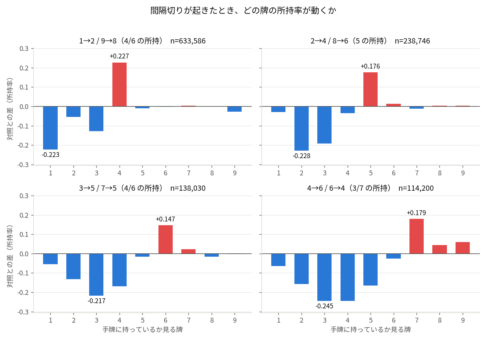
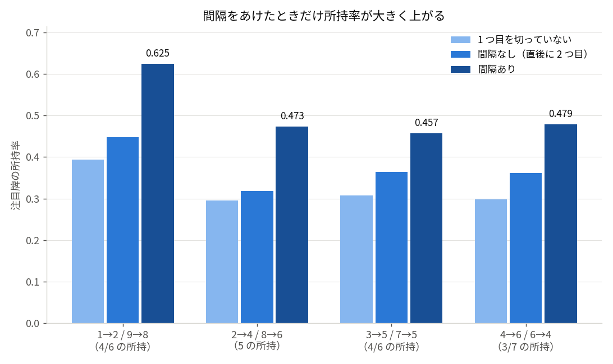
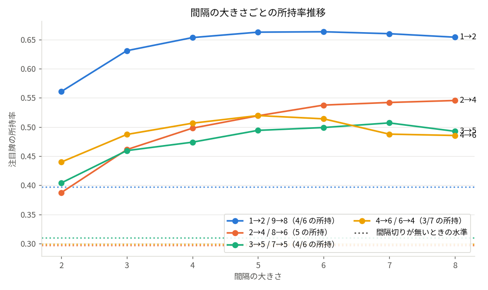
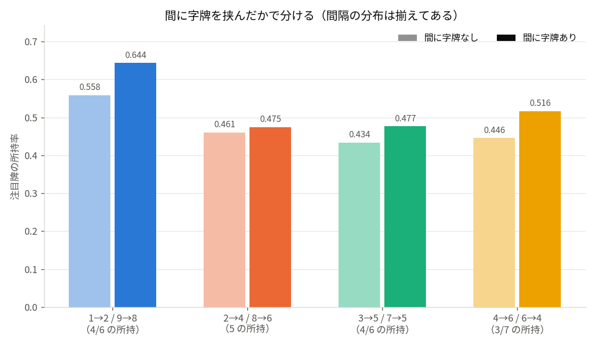
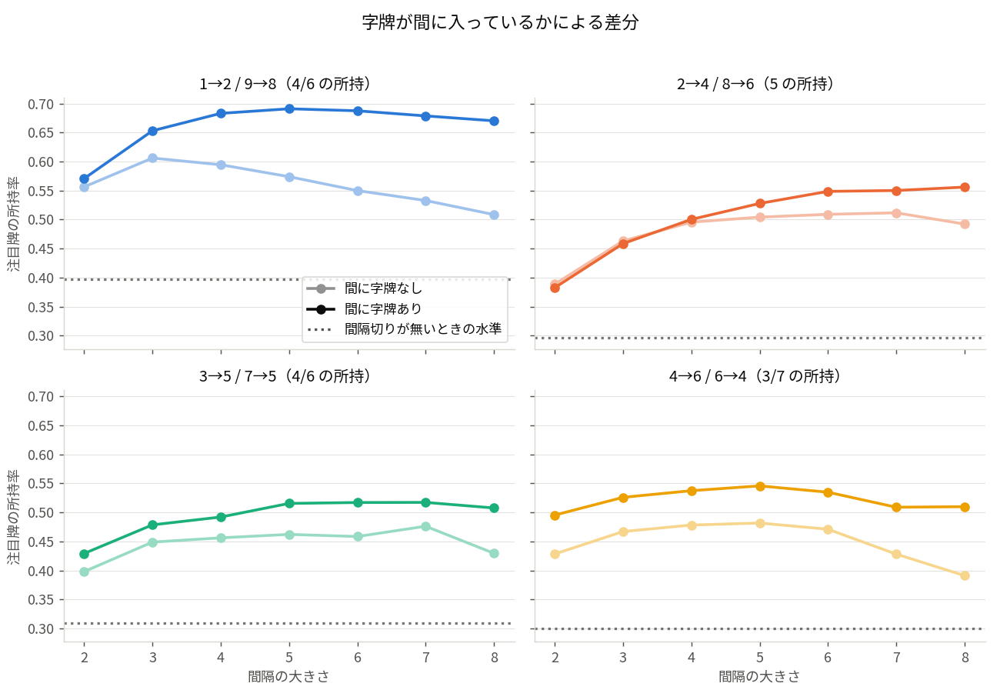

# 間隔切り — 牌のペアを間隔をあけて切ったときの所持牌

## 分析の意図

セオリー「9 を切っている人が、間隔をあけて 8 を手出ししたら 6 を持っている」を検証する。
このセオリーは 1・2 を切る形（1 を切って間隔をあけて 2 を手出し → 4 を持っている）と鏡の関係にあり、
同じものとして扱える。

記事では 1 つのペアだけでなく、次の 4 ペアを同じ枠組みで測る。
いずれも「2 つ目を手出しした人は、**1 つ目に切った牌のスジ（3 つ内側）** を持っている」という形に揃う。

| ペア | 1 つ目 a | 2 つ目 b | 注目する所持牌 | a から見た位置 |
|---|---|---|---|---|
| 12 | 1 | 2 | 4 | 3 つ内側（スジ） |
| 24 | 2 | 4 | 5 | 3 つ内側（スジ） |
| 35 | 3 | 5 | 6 | 3 つ内側（スジ） |
| 46 | 4 | 6 | 7 | 3 つ内側（スジ） |

1 つ目と 2 つ目の距離は 12 だけ隣接で、残りの 3 ペアは 1 つ飛びになっている。

## 分析方法

- **データ**: 天鳳・鳳凰卓（4 人半荘）MJAI、2025 年 全対局 178,888 半荘。リーチ除外。
  門前・リーチ前の対象打牌 19,726,727（うち間隔切り成立 1,582,911）。
- **条件（トリガー）**: 同色で 1 つ目 a を捨て（**手出し・ツモ切りを問わない**）、
  間隔をあけて 2 つ目 b を**手出し**した。間隔は打牌 index で j >= i + 2（直後は含めない）。
- **測定**: b の手出し直後の同色門前手牌に、各数 y = 1..9 を 1 枚以上持つか（0/1）。
- **鏡の折り畳み**: 高位側のペア（98, 86, 75, 64）は canonical y = 10 - y に写して低位側と統合する。
- **状態**（同じ b の手出しを、先行する a の有無・間隔・間に挟んだ字牌で分ける）
  - **間隔あり**: 資格のある先行 a がある（j - i >= 2）。これがトリガー。さらに 1 つ目と 2 つ目の
    **間に**（両端は含めない）字牌を切っているかで 2 つに割る。
    字牌の切り方（手出し / ツモ切り）で所持率に差が出なかったため、**両者は合算する**。
    集計自体は内訳を保っているので、必要なら分けて見られる（`run_noreach_full.txt` の内訳列）。
  - **間隔なし**: 先行 a はあるが直前（j - i = 1）だけ。
  - **先行なし**: a を切っていない。
- **2 指標**:
  - **指標 1 成立率** = P(y を所持 | 間隔あり)。
  - **指標 2 リフト** = 成立率 − 対照の所持率。**対照は「間隔あり以外」**＝間隔なしと先行なしを合わせたもの。
- **巡目標準化**: 対照は打牌 index 別に集計し、間隔あり群の index 分布で重み付けして畳む。
  間隔切りは捨て牌が溜まらないと成立しないため、標準化しないと巡目の差を効果と取り違える。
- **間隔標準化**: 字牌の有無を比べるときは、間隔（j - i）別に集計して間隔あり全体の分布に揃える。
  間隔が長いほど字牌を挟む確率も上がるため、揃えないと間隔の効果を字牌の効果と取り違える。
- 巡目 = 打牌回数、赤 5 は 5 に統合、門前手牌のみ。
- 再現: プロジェクト直下で
  `python3 scripts/kankaku_giri.py --data-dir ~/WorkSpace/blog/08.mahjong/data/2025 --no-reach --workers 16 --cache counters_2025_noreach.npz --out-csv figures/kankaku_giri_2025_noreach.csv`
  （図だけ作り直すなら `cd scripts && python3 figs.py --cache ../counters_2025_noreach.npz --outdir ../figures`）

## 結果

**指標 1 / 指標 2（注目牌）**

| ペア | 注目牌 | 間隔あり n | 成立率 | 対照 | リフト |
|---|---|---|---|---|---|
| 12 | 4 | 633,586 | 0.625 | 0.397 | **+0.227** |
| 24 | 5 | 238,746 | 0.473 | 0.297 | **+0.176** |
| 35 | 6 | 138,030 | 0.457 | 0.310 | **+0.147** |
| 46 | 7 | 114,200 | 0.479 | 0.300 | **+0.179** |

**負に振れる位置（各ペアで最も強いもの）**

| ペア | 見る牌 | 位置 | 成立率 | 対照 | リフト |
|---|---|---|---|---|---|
| 12 | 1 | 1 つ目の牌自身 | 0.044 | 0.267 | −0.223 |
| 24 | 2 | 1 つ目の牌自身 | 0.072 | 0.300 | −0.228 |
| 35 | 3 | 1 つ目の牌自身 | 0.186 | 0.403 | −0.217 |
| 46 | 3 | 1 つ目の 1 つ外側 | 0.208 | 0.452 | −0.245 |
| 46 | 4 | 1 つ目の牌自身 | 0.184 | 0.428 | −0.245 |

### 間隔をあけること自体の効果

**注目牌の所持率（3 状態、巡目標準化）**

| ペア | 先行なし | 間隔なし | 間隔あり |
|---|---|---|---|
| 12 → 4 | 0.394 | 0.448 | **0.625** |
| 24 → 5 | 0.296 | 0.318 | **0.473** |
| 35 → 6 | 0.308 | 0.364 | **0.457** |
| 46 → 7 | 0.298 | 0.361 | **0.479** |

### 間隔の長さ別

**注目牌の所持率（間隔 = 1 つ目と 2 つ目の打牌 index の差）**

| 間隔 | 12 → 4 | 24 → 5 | 35 → 6 | 46 → 7 |
|---|---|---|---|---|
| 2 | 0.561 | 0.387 | 0.404 | 0.440 |
| 3 | 0.631 | 0.461 | 0.460 | 0.487 |
| 4 | 0.654 | 0.498 | 0.474 | 0.507 |
| 5 | 0.663 | 0.519 | 0.494 | 0.520 |
| 6 | 0.664 | 0.538 | 0.499 | 0.514 |
| 8 | 0.654 | 0.546 | 0.493 | 0.486 |
| 10 | 0.637 | 0.551 | 0.488 | 0.480 |
| 11+ | 0.601 | 0.549 | 0.484 | 0.466 |

### 間に字牌を挟むか

**注目牌の所持率（間隔の分布を間隔あり全体に揃えた比較）**

| ペア | 字牌なし | 字牌あり | 差 | n（なし / あり） | 参考: ツモ切り / 手出し |
|---|---|---|---|---|---|
| 12 → 4 | 0.558 | **0.644** | **+0.085** | 234,201 / 399,385 | 0.644 / 0.648 |
| 24 → 5 | 0.461 | 0.475 | +0.014 | 118,438 / 120,308 | 0.480 / 0.476 |
| 35 → 6 | 0.434 | 0.477 | +0.043 | 75,345 / 62,685 | 0.480 / 0.480 |
| 46 → 7 | 0.446 | 0.516 | +0.070 | 64,885 / 49,315 | 0.530 / 0.503 |

右端は合算の根拠として内訳を載せたもの。手出しとツモ切りで所持率はほぼ変わらない。

**12 → 4 の間隔別（字牌なし / 字牌あり）**

| 間隔 | 字牌なし | n | 字牌あり | n | 差 |
|---|---|---|---|---|---|
| 2 | 0.556 | 112,979 | 0.571 | 50,570 | +0.015 |
| 3 | 0.606 | 52,667 | 0.653 | 59,552 | +0.047 |
| 4 | 0.595 | 29,892 | 0.683 | 59,707 | +0.088 |
| 6 | 0.550 | 9,613 | 0.688 | 45,508 | +0.138 |
| 8 | 0.509 | 3,077 | 0.670 | 27,929 | +0.161 |
| 11+ | 0.438 | 1,032 | 0.606 | 30,382 | +0.168 |

**間隔別の「字牌あり − 字牌なし」（4 ペア）**

| 間隔 | 12 → 4 | 24 → 5 | 35 → 6 | 46 → 7 |
|---|---|---|---|---|
| 2 | +0.015 | −0.006 | +0.031 | +0.067 |
| 3 | +0.047 | −0.004 | +0.029 | +0.059 |
| 4 | +0.088 | +0.004 | +0.036 | +0.059 |
| 5 | +0.117 | +0.024 | +0.053 | +0.064 |
| 6 | +0.138 | +0.040 | +0.059 | +0.064 |
| 8 | +0.161 | +0.064 | +0.079 | +0.119 |
| 11+ | +0.168 | +0.071 | +0.097 | +0.140 |

**字牌なし群の落ち方**（ピークから間隔 11 以上まで）

| ペア | ピーク | 間隔 11 以上 | 下げ幅 |
|---|---|---|---|
| 12 → 4 | 0.606（間隔 3） | 0.438 | −0.168 |
| 24 → 5 | 0.512（間隔 7） | 0.483 | −0.029 |
| 35 → 6 | 0.476（間隔 7） | 0.395 | −0.081 |
| 46 → 7 | 0.482（間隔 5） | 0.337 | −0.145 |

## 考察

- **4 ペアすべてでセオリーは成立**。注目牌（1 つ目に切った牌のスジ）の所持率が対照を
  +0.15〜+0.23 上回る。最も強いのは 12 → 4 で、成立率 0.625 は今回の全ペア中で唯一 6 割を超える。
  9 と 8 を切った人が 6 を持っている、という形が最も鋭い。
- **12 が突出するのに、1 つ目と 2 つ目は隣接している**。残り 3 ペアは 1 つ飛びで、
  リフトは +0.147〜+0.179 と横並び。ペアの距離が効果を決めているわけではない。
  端に近いペアほど「1 つ目が浮き牌で、その内側にブロックがある」という形に絞られやすいためと考えられるが、
  この解析だけでは切り分けられない。
- **間隔をあけること自体に効果がある**。3 状態は 4 ペアすべてで
  先行なし < 間隔なし < 間隔あり の順に並ぶ。12 → 4 なら 0.394 → 0.448 → 0.625 で、
  1 つ目を切ったこと自体の寄与（+0.054）より、間隔をあけたことの寄与（+0.177）のほうが大きい。
  セオリーが「間隔をあけて」を条件に挙げているのは、この差に対応している。
- **間隔は 4〜6 でほぼ頭打ち**。12 → 4 は間隔 2 で 0.561、間隔 5〜6 で 0.663 まで上がり、
  そこから緩やかに下がる。間隔が 2 しかない場合は明確に弱く、条件としての「間隔をあけて」は
  3 巡以上を指していると読める。24 → 5 だけは間隔 9 付近まで上がり続け、頭打ちの位置がペアで違う。
  ただしこの曲線は字牌の有無を混ぜたもので、**群を分けると形が変わる**（次項）。
- **負の情報のほうが強いペアがある**。46 → 7 は注目牌が +0.179 なのに対し、
  1 つ目の牌自身（4）と 1 つ外側（3）がともに −0.245。
  「7 を持っている」と読むより「3・4 を持っていない」と読むほうが確度が高い。
  他のペアでも、1 つ目の牌自身が −0.217〜−0.228 と、注目牌の正のリフトと同程度かそれ以上の大きさになる。
- **「間に字牌を挟むと確度が上がる」は成立するが、ペア差が大きい**。
  12 → 4 は字牌なし 0.558 に対し字牌あり 0.644 で +0.085。一方 24 → 5 は +0.014 でほぼ差が無い。
  35 → 6（+0.043）と 46 → 7（+0.070）は中間。セオリーが最もよく当てはまるのは、
  元から最も強い 12（＝9 を切って 8 を手出し）のペアだった。
- **字牌が手出しかツモ切りかで差が出ないので、両者は合算した**。
  12 → 4 で 0.644 対 0.648、35 → 6 では 0.480 対 0.480、46 → 7 はむしろツモ切りのほうが高い
  （0.530 対 0.503）。セオリーの理屈は「字牌を手出しする＝抱えていた安全牌や役牌候補を
  手放した合図」だが、それが正しければツモ切りでは効かないはずで、**この理屈はデータに支持されない**。
  効いているのは字牌の切り方ではなく、「1 つ目と 2 つ目の間に（同色の）数牌を切っていない」
  という条件のほうだと考えられる。間に字牌が入るということは、その間は手牌の他の部分を
  動かしていないという意味になる。ただし本解析は「間に字牌があるか」しか見ておらず、
  間に切った牌の色や種類では分けていないので、ここは推測にとどまる。
- **字牌を挟まない場合、間隔が長いほど所持率は下がる**。12 → 4 の字牌なし群は
  間隔 3 の 0.606 をピークに単調に下がり、間隔 11 以上では 0.438 まで落ちる。
  字牌あり群は 0.57〜0.69 を保つため、**間隔が長いほど両群の差が開く**（間隔 2 で +0.015、
  間隔 11 以上で +0.168）。全体の曲線が「4〜6 で頭打ち」に見えていたのは、
  間隔が長い側ほど字牌を挟む観測の割合が増える（字牌なしの割合は間隔 2 で 69%、
  間隔 11 以上では 3%）ためで、群を分けると別の像になる。
  **間隔 2 では字牌の有無でほとんど差がない**（0.556 対 0.571）点も、
  「間隔が短いうちは手牌がまだ動いていない」という読みと整合する。
- **間隔が長いほど字牌が効くのは 4 ペア共通**。どのペアも差は間隔 11 以上で最大になる。
  一方で短い間隔での効き方は分かれ、端寄りの 12・24 は間隔 2〜3 でほぼ差が無い
  （24 はわずかに負）のに対し、中寄りの 35・46 は間隔 2 の時点で +0.03〜+0.07 ある。
- **24 → 5 の効果が小さく見えるのは、n が短い間隔に偏っているため**。
  間隔 2〜3 だけで 115,818 件（間隔ありの 48%）を占め、そこで差がゼロなので
  合算値が +0.014 まで下がる。間隔 6 以上に限れば +0.040〜+0.071 で、他ペアと大きくは変わらない。
  合算値を「このペアではセオリーが効かない」と読むのは誤り。
- **字牌を挟まないまま間隔が開いた場合の落ち方もペアで違う**。12 → 4 は −0.168、
  46 → 7 は −0.145 と大きく落ちるが、24 → 5 は −0.029 しか落ちない。
  落ち幅の大きいペアほど、字牌の有無で読みが分かれることになる。
- **巡目標準化で効果は縮む**。標準化前のリフトは 12 → 4 で +0.325 だが、標準化後は +0.227。
  間隔切りの成立自体が捨て牌の蓄積を要求するため、標準化しないと効果を 4 割ほど過大に見積もる。
- **対照に「間隔なし」を混ぜても結論は変わらない**。間隔なしは対照全体の 2.3〜6.5% しかなく、
  対照の水準は先行なし単独とほぼ同じ（12 → 4 で 0.397 対 0.394）。

## 留意点

- 1 つ目の切りは手出し・ツモ切りの両方を含む。手出しに限定すれば信号はさらに強まる可能性がある。
- 対象は門前手牌のみ・リーチ前のみ。副露者を含めるとリフトは 12 → 4 で +0.211、24 → 5 で +0.168、
  35 → 6 で +0.142、46 → 7 で +0.167 と、門前限定よりやや小さくなる（`run_noreach_full.txt` の後半）。
- 同じ打牌が複数ペアの 2 つ目になりうる（たとえば 4 の手出しは、低位の 24 と鏡像側の 64 の両方で
  2 つ目になる）。その場合は各ペアの集計に独立に入る。
- 間隔の定義は打牌 index の差で、実時間や他家の打牌数ではない。
- 1 つ目を複数回切っている場合、資格を満たすもののうち最も近いものを間隔として採用する。
- 牌単位の所持（P >= 1）のみを見ており、形（ターツ・対子）は判定していない。
  トイツ落としの間隔切りは別途扱う。
- 「間に字牌」は 1 つ目と 2 つ目の打牌 index の間にある自分の打牌だけを見る。
  枚数や字牌の種類（役牌・オタ風・ションパイか）では分けていない。
  手出しとツモ切りは差が無かったため合算したが、集計は内訳を保持している。
- 間に切った牌が「同色の数牌か、他色の数牌か、字牌か」で分ければ、
  上の解釈（効いているのは字牌そのものではない）を直接検証できる。これは未実施。
