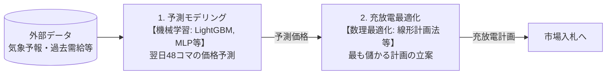

# 注意書き

この記事は、著者が個人開発の中で調べたことや試したことを整理した備忘録として書いています。
あわせて技術記事という性格上、実際に手元で試す場合は原典や実装、前提条件を確認したうえで各自の責任で扱ってください。

# はじめに

普段は機械学習やデータ分析に触れているのですが、エネルギー分野（特に蓄電池アービトラージ）における予測タスクに興味を持ち、色々と調べて実装してみました。

この記事では、JEPX（日本卸電力取引所）のスポット価格予測と、蓄電池の充放電スケジューリングを取り上げます。

実際に検証を回してみて非常に面白かったのが、一般的な機械学習の評価指標である「予測誤差」を小さくすることと、ビジネス上の「実際の収益」が必ずしも一致しないという点です。

本記事では、ドメイン外の視点から調べた市場の制約を整理しつつ、「順序学習」を用いたアプローチで収益改善を図った検証結果をまとめます。

# 1. 前提知識：電力市場と蓄電池ビジネスの実態

技術的な分析に入る前に、まずはドメインとなる電力取引市場の前提と、蓄電池ビジネスの収益構造について、調べた範囲で整理しておきます。

## 電力取引市場（JEPX）とは

日本卸電力取引所（JEPX）は、発電事業者や小売電気事業者が電力を売買する市場です。様々な市場が存在するようですが、本記事でターゲットにするのは翌日分の電力を取引する **「スポット市場（前日市場）」** です。

スポット市場では、1日（24時間）を30分ごとに区切った **計48コマ** の電力について取引が行われます。参加者は「明日のこの時間帯に、この価格で買いたい/売りたい」という入札を行い、需要と供給のカーブが交わる点で価格（システムプライス/エリアプライス）と約定量が決まる仕組みです。

重要な制約として、 **翌日48コマ分の入札はすべて「前日の朝10時」に締め切られます** 。
*参考：[日本卸電力取引所（JEPX） スポット市場](https://www.jepx.jp/)*

## 取引の仕組みと収益化のハードル

蓄電池を用いたビジネスでは、JEPX電力市場において **「安い時間帯のコマで電力を買って充電し、高い時間帯のコマで放電して売る」** ことで利鞘を抜くアービトラージ（裁定取引）によって収益化を図ります。

入札から実行までの全体の大まかな流れは以下の通りです。


しかし、これは単純に「価格差が1円でもあれば儲かる」というものではないようです。実務上は、以下の2つの大きなコストを上回るスプレッド（価格差）を見つけ出す必要があるとのことでした。

1. **充放電ロス（往復効率）**: 蓄電池の充放電には熱などのロスが生じます。実機では充電した電力の約87%程度しか放電に回せないそうです。つまり、放電価格が充電価格の1.15倍以上でなければ、その時点で損失が出ます。
2. **電池の劣化コスト**: 充放電を繰り返すことで蓄電池は物理的に劣化（寿命が減少）します。初期投資額や容量から算出すると、1kWhの充放電あたり約13〜22円（本記事では17円と仮定）の劣化コストが実質的に発生します。

これらのハードルがあるため、スポット市場単独での収益化は極めてシビアなビジネスとなっているようです。
*参考：[拡大する系統用蓄電池ビジネスの成功の鍵 - 収益性評価と運用高度化](https://www.mri.co.jp/knowledge/column/20231110.html)（三菱総合研究所 / 充放電ロスや劣化コストを考慮したアービトラージの運用について）*

## 技術の介入要素と本記事の立ち位置

調べていく中で、このシビアな市場で収益を上げるために技術が介在する要素は、大きく2つに分かれることがわかりました。



1. **予測モデリング**: 気象予報や過去の市場価格・需給データから、翌日48コマの価格をいかに正確に予測するか。
   * 機械学習全般（今回のベースラインでは **LightGBM** 、改善案では **MLP** を使用）
2. **充放電最適化（スケジューリング）**: 予測された価格と、蓄電池の物理的・経済的な制約（容量、最大出力、充放電効率、劣化コスト）を数式として定式化し、最適な計画を解く。
   * 数理最適化（本記事では `scipy.optimize.linprog` の **HiGHSソルバー** を用いた **線形計画法(LP)** を使用）

本記事は、 **「1. 予測モデリング」** のアプローチを起点としつつ、単なる予測精度の追求にとどまらず、 **「予測結果を2の最適化ソルバーに通したときの最終的な収益」** との関係性に踏み込んで検証を行います。

## 本記事の評価指標（VCRとKendall τ）

本記事では、予測モデルの良さを単なる誤差（RMSE等）だけでなく、実務に即した以下の2つの指標で評価します。

- **オラクル比（VCR: Value Capture Ratio）**
  ビジネス上の最終的な「収益の達成率」を示す指標です。「仮に翌日の価格を1円の狂いもなく完全予知（オラクル）できた場合に得られる最大の売買差益」を100%としたとき、予測モデルを用いた計画でその何%を獲得できたかを表します。
  
- **Kendall τ（ケンドールのタウ）**
  予測の「順序の正確さ」を示す指標です。予測した48コマの価格の「1日の中での高さの順番（ランキング）」が、実際の順番とどれくらい一致しているかを表します。1.0に近いほど順序が完璧に当たっていることを意味します。

# 2. 実運用制約下でのベースライン構築

JEPXスポット市場の翌日分の取引は、**前日の朝10時に締切**となります。そのため、予測モデルに入力できる特徴量は「前日10時までに確定・公表されている情報」に限られます。

## 情報のリークを防ぐ

過去データを用いて学習する際、以下のようなデータをうっかり使ってしまうと「未来の情報リーク」となり、実運用では再現できない精度が出てしまいます。

- 当日の気象実測値
- 前日の東電エリア需給実績（公開は翌朝6時頃だが前日10時には間に合わない）

今回のベースライン構築では、気象データとしてOpen-Meteoの過去予報API（previous_runs）から「前日発行の予報ラン」を取得し、需給情報は前々日（D-2）以前のラグ特徴量のみを使用することで、厳密な実運用制約を再現しました。

## ベースライン（LightGBM）の結果

この条件でLightGBMを用いて構築した点予測モデルを、線形計画法（LP）による充放電最適化ソルバーに通した結果は以下の通りです。（テスト期間: 185日、劣化コストは便宜上0として計算）

| モデル | MAE | RMSE | Kendall τ (順位) | 収益(円/日) | オラクル比 |
|---|---|---|---|---|---|
| LightGBM (点予測ベースライン) | 3.54 | 5.30 | 0.595 | 1,481 | 64.7% |

このオラクル比約65%という水準を基準に、さらなる改善を目指します。

# 3. 予測精度（RMSE）と収益の乖離

機械学習モデルの改善というと、通常はRMSEやMAEといった誤差指標を小さくすることを目指します。しかし、最適化ソルバーを通して収益を評価すると、非常に興味深い現象が確認できます。

## 予測が外れても収益は下がらない？

極端な思考実験として、真の価格（完全予知）に対して意図的に様々な歪みを加えた予測データを作成し、LPに通して収益を計測しました。

| 予測の作り方 | RMSE | Kendall τ (順位) | 収益(円/日) | オラクル比 |
|---|---|---|---|---|
| 真の価格（オラクル） | 0.00 | 1.000 | 2,288 | 100.0% |
| **全コマの価格を1.5倍** | **10.44** | 1.000 | **2,288** | **100.0%** |
| 全コマの価格を一律+5円 | 5.00 | 1.000 | 2,284 | 99.8% |
| 実際のLightGBM予測 | 5.09 | 0.754 | 1,487 | 65.0% |

注目すべきは「全コマの価格を1.5倍」にしたケースです。RMSEは10.44と実際の予測モデルの2倍も悪化しているにもかかわらず、収益は完全予知とまったく同じ100%を達成しています。

## LPにとって重要なのは「順序」

なぜこのようなことが起きるのでしょうか。それは、LPの定式化においてすべての価格を1.5倍に定数倍した場合、「目的関数（最大化したい利益）」のスケール全体が1.5倍になるだけで、最適解（いつ充放電するか）自体は変わらないからです。

つまり、充放電計画を決めるLPソルバーにとって、価格の「絶対値の正確さ」以上に、1日48コマの中での **「どの時間が高いか・安いかという順序（ランキング）」** が何よりも重要であるということです。

ただし、純粋な順位情報だけを与えれば良いというわけでもありません。蓄電池には充放電ロス（往復効率約87%）があるため、「放電価格が充電価格の1.15倍以上」でなければ損失が出ます。この閾値判定には、価格の絶対値の比率情報が必要です。

つまり、実収益を最大化するには「絶対値の誤差（MSE）」と「日内の順序」の両方を適切に学習させる必要があります。

# 4. 改善案：順序学習（ハイブリッド損失）の導入

誤差と収益の乖離を踏まえ、順序関係を直接学習できるモデルへ変更しました。

## モデルアーキテクチャと損失関数の変更

標準的な回帰タスクとして1コマごとに独立して予測する設定では、同日の他のコマとの順序関係を損失関数に直接組み込むことが困難です。そこで、1日の48コマを同時に出力し、任意のカスタム損失関数（コマ間の順序ペナルティなど）を柔軟に計算しやすい **MLP（多層パーセプトロン）** へアーキテクチャを変更しました。

損失関数には、通常のMSE（絶対値の誤差）と、Pairwise Ranking Loss（2つのコマ間の順序誤差）を組み合わせたハイブリッド損失を採用します。

```python
loss = α * MSE(pred, true) + (1 - α) * pairwise_rank_loss(pred, true)
```

## パラメータ探索と実務の勘所

順位のロスを計算する際、1日48コマのすべてのペア（1,128組）を均等に扱うか、それとも「実際の価格差が大きいペア（スパイク周辺など）」を重視するかという重み付けのパラメータ（β）を設定しました。

Optunaを用いてハイパーパラメータ（α、β、層構成など）を探索した結果、上位の試行はすべて「順序ロスの計算において、価格差による一定の重み付けを行う（β > 0.4）」結果となりました。スパイクが発生する時間帯の順序関係を正確に当てることが、収益に直結していると考えられます。

## 最終比較

テスト期間における比較結果は以下の通りです。（5シード平均）

| モデル | MAE | RMSE | Kendall τ (順位) | 収益(円/日) | オラクル比 |
|---|---|---|---|---|---|
| LightGBM (点予測ベースライン) | **3.54** | **5.30** | 0.595 | 1,481 | 64.7% |
| **MLP (ハイブリッド損失探索後)** | 4.13 | - | **0.628** | **1,568** | **68.5%** |

ハイブリッド損失を導入したMLPモデルは、ベースラインと比較して **MAE（絶対値の平均誤差）は悪化したにもかかわらず、オラクル比（収益ベース）では64.7%から68.5%へと改善** を示しました。

これは、モデルが一見すると予測を外している（絶対値がずれている）ように見えても、ビジネスの目的関数である「収益」に直結する順序関係を上手く捉えられていることを示しています。

# まとめ

JEPX電力市場における蓄電池アービトラージの価格予測において、以下の知見が得られました。

1. **実運用制約の重要性**: 情報境界を厳密に管理しなければ、実運用で発現しない架空の精度を見積もってしまう。
2. **目的関数のズレ**: 機械学習の評価指標（RMSEやMAE）の改善が、必ずしもビジネスのKPI（収益）の向上に直結するとは限らない。
3. **順序学習の有効性**: LPソルバーの性質を理解し、損失関数に順序関係（Pairwise Ranking Loss）を組み込むことで、絶対値の精度を犠牲にしながらも実収益を向上させることができる。

今後、蓄電池ビジネスにおける市場参入が増え、スプレッドの獲得競争が激化していくことを見据えると、単なる予測精度の追求にとどまらず、「いかにして機械学習の出力を実ビジネスの利益に直結させるか」というシステム全体を見据えた設計がより一層重要になってくると考えられます。
